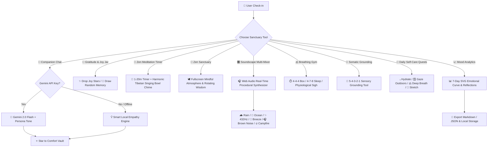

# ✨ Aetheria – Your Emotional Wellness Sanctuary

[](LICENSE)
[](https://developer.mozilla.org/en-US/docs/Web/JavaScript)
[](#)
[](#)
[](https://aistudio.google.com/)
[](#)
[-blueviolet.svg)](#)

> **Aetheria** is a private, multi-sensory emotional wellness sanctuary and companion designed to help you pause, reflect, breathe, ground your senses, meditate, and navigate emotions with warmth and equanimity.

---

## 🏗️ Architectural Flow



---

## 🌟 Comprehensive Feature Suite

### 1. 🏺 Interactive Gratitude & Joy Jar
- **Glowing Memory Stars**: Deposit personal gratitude moments and positive reflections into a virtual glowing glass jar.
- **Draw a Memory**: When facing difficult moments or sadness, tap **"Draw a Memory"** to pull a randomized past joy star with Tibetan chime acoustics.

### 2. 🔔 Zen Meditation Sanctuary & Tibetan Singing Bowls
- **Procedural Singing Bowl Chime**: Additive harmonic Web Audio synthesis replicating authentic resonance (~278Hz, 556Hz, 780Hz, 1112Hz) with smooth decay.
- **Customizable Meditation Sessions**: 1 min, 3 min, 5 min, 10 min, 15 min, or 20 min timer with circular SVG progress animation.

### 3. 🌌 Fullscreen "Zen Sanctuary" Mode
- Immersive distraction-free relaxation space with pulsating aura orb, active soundscapes, and rotating timeless wisdom reflections.

### 4. 🎛️ Multi-Layer Soundscape Mixer
- **Real-Time Procedural Synthesis**: Synthesize multiple calming nature layers simultaneously with independent volume faders:
  - 🌧️ **Gentle Rain**: Filtered pink noise & acoustic droplet physics.
  - 🌊 **Ocean Surf**: Low-frequency oscillating tidal wash.
  - ✨ **432Hz Celestial Drone**: Dual-sine harmonic drone for deep meditation.
  - 🍃 **Forest Breeze**: Modulated bandpass wind sweep.
  - 🎧 **Cozy Brown Noise**: Deep acoustic grounding hum.
  - 🔥 **Campfire Crackle**: Poisson-distributed impulse crackles.

### 5. ⭐ Message Comfort Vault
- Star (⭐) comforting companion messages during chat conversations to save them in your personal **Comfort Vault** for quick comfort on hard days.

### 6. 🌱 Gentle Daily Self-Care Quests
- Daily non-pressuring micro-habits (*Hydrate*, *Gaze Outdoors*, *3 Deep Breaths*, *1 Gratitude*, *Stretch*) with daily streak tracking and completion celebrations.

### 7. 🫁 Multi-Technique Breathing Gym
- **4-4-4 Box Breathing**: Equilibrium, focus, and autonomic balance.
- **4-7-8 Relaxation Breath**: Sleep onset and de-escalation for acute anxiety.
- **Physiological Sigh**: Quick neurochemical reset (2 rapid inhales + 1 prolonged 6s exhale).

### 8. 🌿 5-4-3-2-1 Sensory Grounding Tool
- Somatic guided tool pulling your mind out of anxiety:
  - 👁️ **5 Things you see**
  - ✋ **4 Things you can physically touch**
  - 👂 **3 Things you hear**
  - 👃 **2 Scents you smell**
  - 👅 **1 Taste or self-compassion affirmation**

### 9. 🎭 Companion Persona Switcher
- 🌸 **Empathetic Friend** *(Default)*: Warm, gentle, nurturing, and deeply validating.
- 🧘 **Zen Stoic**: Grounded, calm, philosophical reflections on what you can control.
- ⚡ **Motivational Guide**: Action-oriented, empowering, and uplifting.
- 🤫 **Quiet Listener**: Minimal, tranquil, non-intrusive responses.

### 10. 📈 7-Day Mood Analytics & Data Ownership
- **Dynamic SVG Trend Graph**: Visual emotional balance curve over the last 7 days.
- **Personal Reflection Notes**: Write journal entries alongside mood logs.
- **Data Export & Privacy Hub**: One-click download as **Markdown (`.md`)** or **JSON**.
- **100% Local-First**: No external servers, no tracking, everything saved in your browser's `localStorage`.

### 11. ⚡ Spotlight Command Palette (`Ctrl+K` / `⌘K`)
- Rapid keyboard-driven command navigation to jump to any mindfulness tool, soundscape, or mood.

### 12. 🎙️ Full Voice Interaction
- **Speech-to-Text**: Dictate your thoughts hands-free via the Web Speech API (`🎤`).
- **Text-to-Speech**: Listen to Aetheria's spoken responses with customizable voice synthesis (`🔊`).

### 13. 📱 Progressive Web App (PWA)
- Fully installable on iOS, Android, macOS, and Windows with 100% offline Service Worker caching.

---

## ⌨️ Keyboard Shortcuts

| Shortcut | Action |
| :--- | :--- |
| <kbd>Ctrl</kbd> + <kbd>K</kbd> / <kbd>⌘</kbd> + <kbd>K</kbd> | Open Spotlight Command Palette |
| <kbd>Esc</kbd> | Dismiss any modal, meditation timer, grounding tool, or Zen sanctuary |
| <kbd>Enter</kbd> | Send chat message / Submit input forms |

---

## 🚀 Quick Start & Installation

### Option 1: Direct Browser Launch
1. Clone or download the repository:
   ```bash
   git clone https://github.com/amruthck177/Atheria.git
   cd Atheria
   ```
2. Open `index.html` in any modern web browser (Chrome, Edge, Firefox, Safari).

### Option 2: Local Static Server (Recommended for PWA & Mic Access)
```bash
# Python 3
python -m http.server 3000

# Node.js (npx)
npx serve .
```
Open `http://localhost:3000`.

---

## 🔒 Privacy & Enterprise-Grade API Security

Aetheria operates **100% locally and offline** by default using a heuristic empathy engine. When you connect an optional **Google Gemini 2.0 Flash API key**, the following multi-layer security protections are activated:

1. **🔒 Web Cryptography AES-GCM 256-bit Storage Encryption**:
   - Keys are **never stored in plain text**. Aetheria derives an AES-GCM encryption key on-device via `crypto.subtle` (PBKDF2 with 100,000 SHA-256 iterations) with a unique hardware salt.
2. **🛡️ Header-Based HTTPS Authentication (`x-goog-api-key`)**:
   - The API key is passed strictly in encrypted HTTPS request headers—**never in URL query parameters (`?key=...`)**. This prevents keys from leaking into browser history, proxies, server logs, or referrer headers.
3. **🛡️ Content Security Policy (`CSP`)**:
   - Strict CSP headers prevent cross-site scripting (XSS) and restrict outbound network connections solely to Google's generative language API endpoint.
4. **🧼 Automated Key Redaction in Logs**:
   - Catch handlers and console loggers automatically mask and scrub API keys (`AIzaSy...****`) from all error reports, stack traces, and toasts.
5. **⏱️ Client-Side Token Bucket Rate Limiting**:
   - Built-in debouncing (min 1.5s interval, max 20 requests/minute) protects your free/paid Gemini quota from rapid clicks, loops, or spamming.
6. **🗑️ One-Click Key Purge & Revocation**:
   - Disconnect and wipe your encrypted credentials at any time directly in the **API Key Security Modal**.

---

## 🔑 Optional: Gemini 2.0 Flash AI Setup

1. Get a free API key from [Google AI Studio](https://aistudio.google.com/app/apikey).
2. Click **Connect Gemini AI** (or press `Ctrl+K` -> *Secure API Key Settings*).
3. Paste your key. It is immediately validated and encrypted locally via AES-GCM 256-bit.

---

## 📂 Project Structure

```
Atheria/
├── index.html        # Semantic HTML5 single-page application structure
├── style.css         # Glassmorphism design system & responsive animations
├── app.js            # Soundscape mixer, Tibetan bowls, meditation, AI engine & analytics
├── sw.js             # Service Worker for 100% offline PWA caching
├── manifest.json     # PWA Web App Manifest for mobile/desktop install
└── README.md         # Documentation & guide
```

---

## ❓ Frequently Asked Questions (FAQ)

**Q: Are my messages, jar memories, or notes sent to a remote database?**  
*A: No. Aetheria has zero backend and zero tracking. All journal entries, gratitude stars, starred vault messages, and preferences are stored solely on your local device.*

**Q: Do soundscapes and singing bowls require an internet connection?**  
*A: No. All audio (Rain, Ocean, 432Hz Drone, Breeze, Brown Noise, Campfire, Tibetan Singing Bowl) is procedurally synthesized in real time using the browser's Web Audio API.*

**Q: How do I install Aetheria as an App on my phone?**  
*A: Open Aetheria in Chrome or Safari, tap the share/menu icon, and select **"Add to Home Screen"**.*

---

## 🤝 Contributing & Feedback

Suggestions and contributions are welcome!
1. Fork the repo (`git checkout -b feature/NewFeature`)
2. Commit your changes (`git commit -m 'Add NewFeature'`)
3. Push to branch (`git push origin feature/NewFeature`)
4. Open a Pull Request

---

## 📄 License

Distributed under the MIT License. See `LICENSE` for details.

<p align="center">
  Made with 💜 for emotional well-being, tranquility, and mindful living.
</p>
